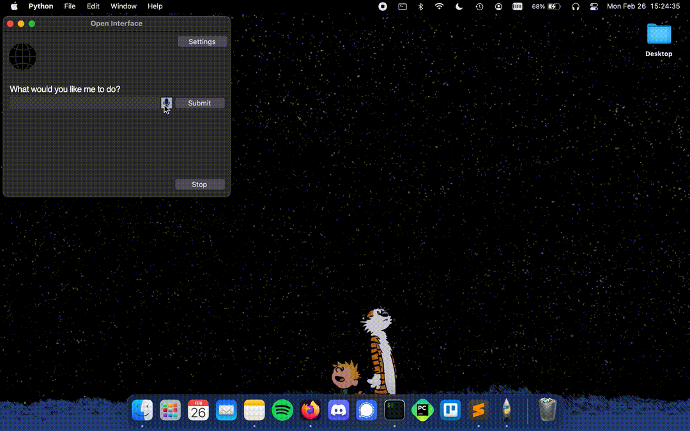

# Open Interface

<picture>
	
</picture>

### Operate Your Computer Using LLMs

Open Interface can
- Execute user requests by sending them to an LLM backend (GPT-4V) with a current screenshot.
- Simulate keyboard and mouse input to automatically execute the steps received from the LLM to operate your computer.
- Take user requests through text or voice.

<div align="center">

  [](https://github.com/AmberSahdev/Open-Interface?tab=readme-ov-file#install)
  [](https://github.com/AmberSahdev/Open-Interface?tab=readme-ov-file#install)
  [](https://github.com/AmberSahdev/Open-Interface?tab=readme-ov-file#install)
  <br>
  []()
  
  

</div>

### Demo


<hr>

### Install
<details>
    <summary><b>MacOS</b></summary>
    <ul>
        <li>Download the MacOS binary from the latest <a href="https://github.com/AmberSahdev/Open-Interface/releases/latest">release</a>.</li>
        <li>Unzip the file and move Open Interface to the Applications Folder.<br><br> 
            
        </li>
        <br>
        <li>
            Launch the app from the Applications folder.<br>
            You might face the standard Mac <i>"Open Interface cannot be opened" error</i>.<br><br>
            <br>
            In that case, press <b><i>"Cancel"</i></b>.<br>
            Then go to <b>System Preferences -> Security and Privacy -> Open Anyway.</b><br><br>
             &nbsp; 
             &nbsp;
             
        </li>
        <br>
        <li>
        Lastly, Open Interface will also need Accessibility access to use your keyboard and mouse for you, and Screen Recording access to take a screenshot to assess its progress.<br><br>
        <br>
        
        </li>
        <li>Checkout the <a href="https://github.com/AmberSahdev/Open-Interface?tab=readme-ov-file#setup">Setup</a> section to connect Open Interface to LLMs (OpenAI GPT-4V)</li>
    </ul>
</details>
<details>
    <summary><b>Linux</b></summary>
    <ul>
        <li>Linux binary has been tested on Ubuntu 20.04 so far.</li>
        <li>Download the Linux zip file from the latest <a href="https://github.com/AmberSahdev/Open-Interface/releases/latest">release</a>.</li>
        <li>
            Extract the executable and run it from the Terminal via <br>
            <code>./Open\ Interface</code>
        </li>
    </ul>
</details>
<details>
    <summary><b>Windows</b></summary>
    <ul>
      <li>Windows binary has been tested on Windows 10.</li>
      <li>Download the Windows zip file from the latest <a href="https://github.com/AmberSahdev/Open-Interface/releases/latest">release</a>.</li>
      <li>
          Unzip the folder, move the exe to the desired location, double click to open, and voila.
      </li>
    </ul>
</details>


### Setup
<details>
    <summary><b>Set up the OpenAI API key</b></summary>

- Get your OpenAI API key
  - Open Interface needs access to GPT-4V to perform user requests. GPT-4V keys can be downloaded from your [OpenAI account](https://platform.openai.com/).
  - [Follow the steps here](https://help.openai.com/en/articles/8264644-what-is-prepaid-billing) to add balance to your OpenAI account. To unlock GPT-4V a minimum payment of $5 is needed.
  - [More info](https://help.openai.com/en/articles/7102672-how-can-i-access-gpt-4)
- Save the API key in Open Interface settings
  - In Open Interface, go to the Settings menu on the top right and enter the key you received from OpenAI into the text field like so: <br>
  <br>
  <picture>
	
  </picture><br>
  <br>
  - After setting the API key for the first time you'll need to restart the app.

</details>

<hr>

### Many of the Things it's Bad at

- Accurate spatial-reasoning and hence clicking buttons.
- Keeping track of itself in tabular contexts, like Excel and Google Sheets, for similar reasons as stated above.
- Navigating complex GUI-rich applications like Counter-Strike, Spotify, Garage Band, etc due to heavy reliance on cursor actions.


### Future 
(*with better models trained on video walkthroughs like Youtube tutorials*)
- "Find my friends' music taste from Spotify and create a party playlist for tonight's event."
- "Create a couple of bass samples for me in Garage Band for my latest project."
- "Take the pictures from my Tahoe trip and make a White Lotus type montage in iMovie."

### Notes
- Cost: $0.05 - $0.20 per user request.<br>
(This will be much lower in the near future once GPT-4V enables assistant/stateful mode)

<hr>

### System Diagram 
```
+----------------------------------------------------+
| App                                                |
|                                                    |
|    +-------+                                       |
|    |  GUI  |                                       |
|    +-------+                                       |
|        ^                                           |
|        |                                           |
|        v                                           |
|  +-----------+  (Screenshot + Goal)  +-----------+ |
|  |           | --------------------> |           | |
|  |    Core   |                       |    LLM    | |
|  |           | <-------------------- |  (GPT-4V) | |
|  +-----------+    (Instructions)     +-----------+ |
|        |                                           |
|        v                                           |
|  +-------------+                                   |
|  | Interpreter |                                   |
|  +-------------+                                   |
|        |                                           |
|        v                                           |
|  +-------------+                                   |
|  |   Executor  |                                   |
|  +-------------+                                   |
+----------------------------------------------------+
```